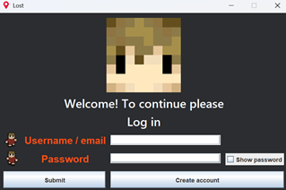
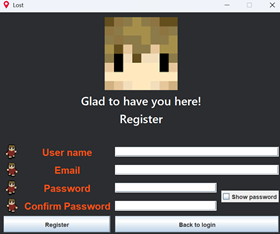
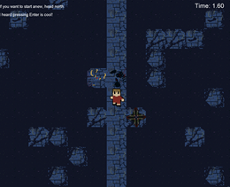
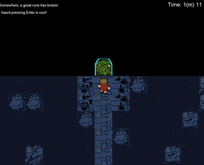
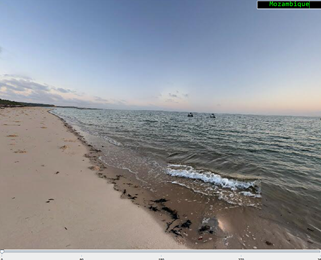
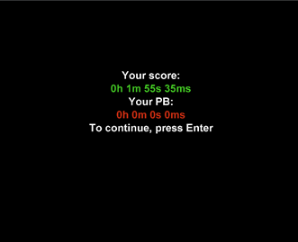

# 2D-GeoGuessing-Game

2D-GeoGuessing-Game is a Java Swing-based 2D puzzle-adventure + geolocation mini-game.
Includes maze traversal, item pick-up, portal unlock, time scoring, leaderboard, and a Street View-style geoguess challenge with user login + DB-backed persistence.

---

## 🌟 Project Overview

- Main gameplay:
  - Tile-map movement (`GamePanel`, `Map`, `Tile`)
  - Map 1 and Map 2 switching
  - Maze generation starter (`MazeGeneratorBFS.makeMaze()`)
  - Collision detection (`CheckCollision`)
  - Item/fragment collection (`ItemSetter`, `ObjectManager`, `Compass`, `DarkCompass`, `Door`, `Fragments`)
- Geo game mode:
  - `GeoGameManager`, `StreetViewImage`, `GuessLocation`
  - Slider-based heading (`GeoSlider`)
  - Guess input component (`GuessTextField`)
- UI + audio:
  - `GameWindow`, `MainPanel`, `EndingPanel`, `UserInterf`
  - `MusicPlayer`
- Login/register + security:
  - `Login`, `Register`, `LogInRegister`, `BCrypt`, `PasswordUtils`
  - DB-backed accounts + best scores (`AccountConnect`, `GameConnect`, `GeoConnect`, `UIConnect`)
- State machine:
  - `State` enum: `TITLE_SCREEN`, `MAP1`, `MAP2`, `PLAYS_GEO`, `PAUSE`, `GAME_END1`, etc.

---

## 🛠️ Requirements

- Java 8+ (recommended Java 11+)
- PostgreSQL server
- Build environment: IntelliJ/IDEA or `javac` + `java`
- Assets available in `MyGame/images/..`
- Map definitions in `MyGame/maps/map1.txt` and `MyGame/maps/map2.txt`

---

## 🧩 Database setup

1. Create DB `tilecollision` (or adjust `DBInfo.url`)
2. Configure connection in `MyGame/src/ConnecToDB/DBInfo.java`:
   - `url = jdbc:postgresql://localhost:5432/tilecollision`
   - `user = postgres`
   - `password = <your password>`
3. Import SQL schemas in:
   - `MyGame/public/*.sql`
   - Optionally `DB/GAME_localhost-...-dump.sql`
4. Tables include:
   - `users`
   - `scores`, `mostrecentscore_id_seq`
   - `country`, `locations`
   - `tips`, `mapforobj`, `collisions`, `messages`

---

## ▶️ Build + Run

### Option A: IntelliJ (recommended)
1. Open `MyGame/MyGame.iml` or root folder.
2. Set project SDK 11+.
3. Run `MainGame.Main`.
4. Ensure `resources` are in classpath (`images/`, `Maps/` loaded by `ClassLoader`).

### Option B: Command line
(In `MyGame/src`)
1. `javac -d ../../out --module-path ...` (depends on JDK setup; no external JARs strictly needed)
2. `java -cp ../../out MainGame.Main`

> If using relative path and resource loading fails, run from root where `images/` and `Maps/` exist.

---

## ⌨️ Controls

- Movement: arrow keys / `W A S D`
- Enter: text + UI accept
- `P`: pause/unpause
- `R`: reset (flag)
- During title screen: Enter begins level

---

## 🔥 Gameplay flow

1. Title screen → Enter → `State.MAP1`
2. Collect fragments + follow clues
3. Find dark compass / open portal
4. `State.PLAYS_GEO` enters geoguess mini-game:
   - receives random valid location from DB
   - text field + answer via `GuessLocation`
5. End when enough fragments or success:
   - `State.GAME_END1`
   - `EndingPanel` shows scoreboard + record

---

## 💾 Leaderboard + score logic

- `EndingPanel.prepareEndingPanel()`:
  - retrieves user ID via `accountConnect`
  - creates run with `TimeScore(gamePanel.timeInSec)`
  - updates best run if new best
  - highlights own score in `ScoreTable`
- `ScoreBoard` persists globally (SQL)

---

## 🗂️ Structure quick guide

- `src/Components`: window + panels + UI screen manager
- `src/GameLogic`: keyboard+collision+items
- `src/Map`: world maps + tile loading
- `src/geoGame`: location guess logic
- `src/Display`: GUI drawing and texts
- `src/ConnecToDB`: DB CRUD wrappers
- `src/RegisterForm`: login/register forms
- `src/Music`: sound effects
- `src/GameState`: state enums + timer + user status
- `public`: DB scripts for setup

---
## Sneak peak of the game

## 🧪 Developer notes

- Map tile collision loaded from DB in `Map.preloadImages(...)`
- `Map.createMap(...)` reads `Maps/mapN.txt`
- `Player` is position/animation manager in `Entity/`
- `StateManager` orchestrates transitions in `GameState/StateManager.java`
- Geo data uses `GeoConnect` and `locations` DB table

---

## 🚀 Quick start checklist

- [x] PostgreSQL running
- [x] DB schema loaded
- [x] `DBInfo` credentials set
- [x] images + map text files in place
- [x] run `MainGame.Main`
- [x] login/register + play

---

## 🛟 Troubleshooting

- `NullPointer` on maps: verify `Maps/map*.txt` exists and no path mismatch.
- `SQL` failures: verify table structure + user rights.
- keyboard focus: ensure game panel selected; if not, click inside window.
- audio: requires system audio and may fail silently if not found.

---

## 🤝 Contribution / extension ideas (for future updates) - act as my personal TODO

- add smoother animation & camera (camera follow)
- dynamic map loading, infinite world, mouse camera
- add settings menu + volume + key mapping
- create build scripts (Maven/Gradle)
- add unit tests for `Map`, `StateManager`, `AccountConnect`

---

